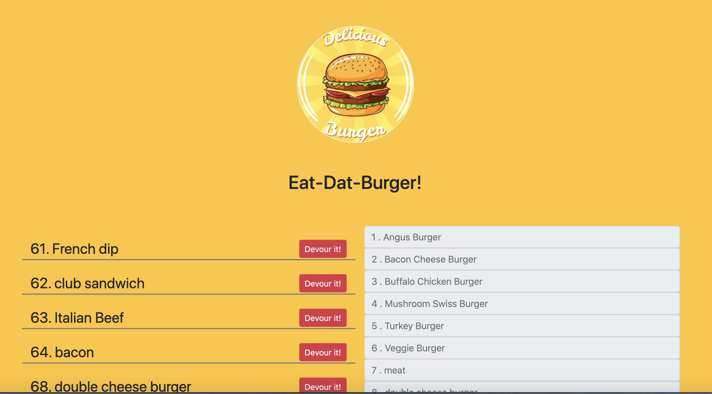
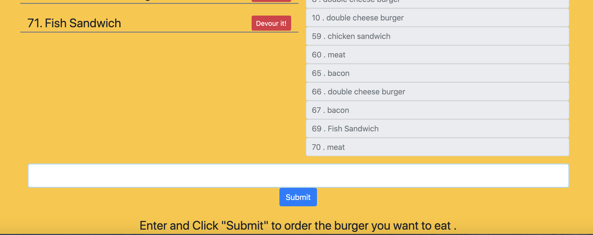

# Burger-Yummy
## Description
   Burger-Yummy is an applications devloped following the MVC (Model View Controller) architectural pattern.
   1. The `Model`(`berger.js`) is part of our app concerned with mysql database interaction. 
   2. `Views` is a directory responsible for dynamic generation of an HTML using a template engine. `The main.hundlebars `in the `layouts` diretory is responsible for the html template with a link to the `index.handlebars` template for the body.
   3. `Controllers` handles input from the user, interacts with the Model to create, read, update or delete data, and then returns the results of that query to the user via the View layer. 
   4. `config` for hundling the connction to the mysql database.
   5. `server.js` that runs the our app in the server and listening to the port
   6. `db` contains sql database and table creaction information.
   7. `.gitignore` file to ignore node files from commiting as it is included in the dependencies.
   8. Last but not least, `package.json` project information with the dependenies to be installed.
   ## Table of Contents
   * [Installation Instructions](#installation-instructions)
   
   * [Usage Instructions](#usage-instructions)
   
   * [Contribution](#Contribution)
   
   * [Developers Contact Information](#Developers-Contact-Information)
     
  * [License](#license)

   ## Installation Instructions
   The developer is authorizing a free usage and installation by cloning from the code [Bbeyenene/Burger-Yummy](https://github.com/Bbeyenene/berger-yummy).
   ## Usage Instructions
   You can order your sandwich by typing in the input and submit. The order gets saved in the data base and it is shown in the left side until the devour it button is hit. Once the devour it button is clicked the order is send to the right side of the page where it is saved as the devour processed data.
   ## Image of the deployed web page
   
    

   ## Contribution
   [Bbeyenene](https://github.com/Bbeyenene) is the only contrubuter to this project.
   
   ## Developers Contact Information
   * LinkdIn Profile: [Berhane](https://www.linkedin.com/in/berhane-beyene/)
   * URL : https://burgeryummy.herokuapp.com/burgers
   * Email: monoxica2004@yahoo.com
   ## License
   This application is licensed under .