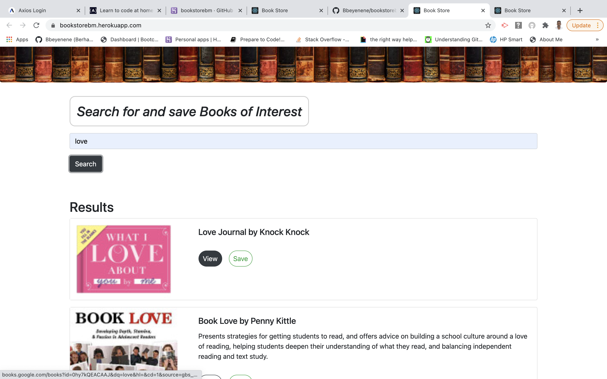

# Bookstorebm
## Description
   Bookstorebm is a
   ## Table of Contents
   * [Installation Instructions](#installation-instructions)
   
   * [Usage Instructions](#usage-instructions)
   
   * [Contribution](#Contribution)
   
   * [Developers Contact Information](#Developers-Contact-Information)
     
  * [License](#license)

   ## Installation Instructions
  * [bookstorebm](https://bookstorebm.herokuapp.com/)
  * [usage instructions](#usage-instructions). Moreover, the developer is authorizing a free usage and installation by cloning from the code [Bbeyenene/bookstorebm](https://github.com/Bbeyenene/bookstorebm).
   ## Usage Instructions
   1. Home Page 
    

   2. Seach Result
    
   
   3. Saved Book
    
   
   ## Contribution
   [Bbeyenene](https://github.com/Bbeyenene) is the only contrubuter to this project.
   
   ## Developers Contact Information
   * LinkdIn Profile: [Berhane](https://www.linkedin.com/in/berhane-beyene/)
   * URL : [bookstorebm](https://bookstorebm.herokuapp.com/) 
   * Email: monoxica2004@yahoo.com
   ## License
   This application is licensed under .
